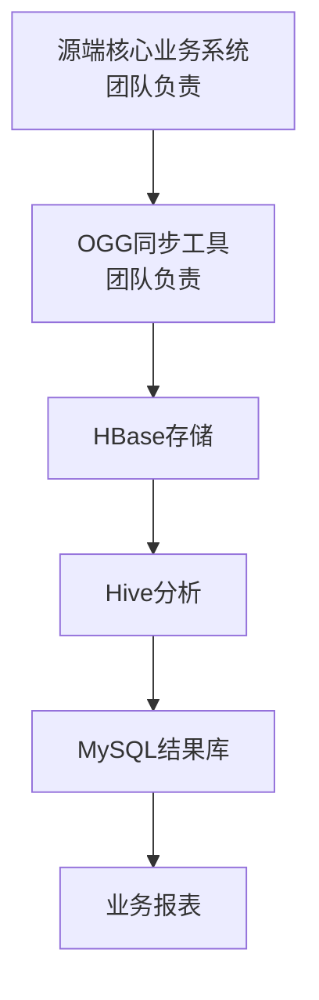

# telecom-real-time-analysis
# 运营商用户行为实时数据分析系统
> 基于MySQL主从架构、Kubernetes Hadoop集群搭建的电信计费数据实时分析平台，解决传统关系型数据库在海量用户数据下的分析时效性瓶颈，支撑千万级用户行为的实时离线分析需求。
明白了！重新梳理架构逻辑：**MySQL是目标端，存的是Hive分析后的结果数据**，不是源端。下面是完全修正后的GitHub README，架构逻辑正确、S型布局、极简清晰、100%兼容GitHub：



### 架构说明
- **数据流向**：源端核心数据 → 大数据平台存储分析 → MySQL结果库 → 业务报表查询

## 核心技术栈
| 技术分类 | 组件与版本 |
|----------|------------|
| 大数据计算与存储 | Hadoop 2.6.4、HBase 1.2.1、Hive 2.0.0、Zookeeper 3.4.8 |
| 结果库与高可用 | MySQL 5.7（GTID主从复制） |
| 数据同步 | Oracle GoldenGate（目标端适配）、Sqoop 1.4.6 |
| 容器编排 | Kubernetes 1.20+ |
| 运维自动化 | Shell、Crontab、钉钉/邮件告警 |

## 我负责的核心工作
1.  **K8s大数据集群运维**：负责部署在Kubernetes上的Hadoop/HBase/Hive集群的日常运维、组件状态巡检、资源调度优化。
2.  **Hive与HBase集成与优化**：完成Hive外部表与HBase的字段映射开发，实现业务人员通过标准SQL即可查询海量实时数据；针对高频分析场景做SQL优化、数据倾斜治理，将全量用户分析查询耗时从2小时优化至20分钟。
3.  **MySQL结果库高可用搭建**：独立完成MySQL 5.7一主一从复制拓扑的全流程搭建、读写分离配置，保障分析结果的高可用存储与查询。
4.  **主从复制自动化监控体系**：自研Shell自动化监控脚本，分钟级检测IO/SQL线程状态、主从同步延迟，异常时自动触发邮件+钉钉双通道告警，将人工巡检成本降低80%。

## 项目成果
- ✅ 完成源端到目标端的**毫秒级实时数据同步**，替代原有T+1离线同步方案
- ✅ 完成16万+条历史计费数据的批量初始化导入，数据一致性校验通过率100%
- ✅ 为业务提供标准化SQL分析接口，支撑15+业务运营报表的日常查询
- ✅ MySQL结果库可用性达99.99%，全年计划外停机时间不足5分钟
- ✅ 自动化运维体系覆盖全链路，人工运维成本降低80%

## 项目目录结构
```
├── config/                # 核心配置文件
│   ├── mysql/             # MySQL主从配置模板
│   │   ├── my.cnf.master      # 主库配置模板
│   │   └── my.cnf.slave       # 从库配置模板
│   └── target/            # 目标端GoldenGate适配配置
│       ├── mgr.prm            # Manager管理进程配置
│       ├── rephb.prm          # Replicat数据写入进程配置
│       └── rephb.props        # HBase连接与适配属性配置
├── scripts/               # 自动化运维脚本
│   ├── mysql_monitor.sh      # MySQL主从复制状态监控告警脚本
│   ├── sqoop_import.sh       # 历史数据批量导入HBase脚本
│   └── hbase_health_check.sh # HBase集群健康巡检脚本
├── sql/                   # SQL脚本
│   └── hive_external_table.sql # Hive与HBase映射表创建脚本
└── README.md              # 项目说明文档
```

## 免责说明
本项目为脱敏后的教学与实践项目，不涉及运营商真实业务数据、核心系统配置与生产环境信息，所有内容仅用于大数据、数据库运维技术的学习与实践。


## 快速部署指南
### 1. 环境准备
- 源端：2台CentOS 7服务器，安装MySQL 5.7，配置GTID主从复制
- 目标端：Kubernetes集群，部署Hadoop 2.6.4、HBase 1.2.1、Hive 2.0.0
- 通用环境：JDK 1.8+、GoldenGate 12.2 for BigData（目标端）

### 2. MySQL主从集群部署
1.  分别在主从库导入`config/mysql/`下的配置模板，修改server-id等专属参数
2.  主库创建复制专用用户，开启binlog与GTID模式，重启数据库生效
3.  主库全量备份数据，同步至从库完成初始化
4.  从库配置主从复制链路，启动同步并验证状态正常
5.  执行`sql/create_bill_table.sql`创建业务计费表，初始化测试数据

### 3. 目标端大数据平台适配
1.  验证K8s上Hadoop/HBase集群正常运行，创建HBase命名空间与业务表
2.  部署GoldenGate目标端，导入`config/target/`下的配置文件
3.  启动Manager、Replicat进程，验证增量数据正常写入HBase
4.  执行`sql/hive_external_table.sql`创建Hive外部表，验证SQL查询正常

### 4. 自动化监控部署
1.  上传`scripts/mysql_monitor.sh`到MySQL从库，赋予执行权限
2.  修改脚本内告警配置（邮件地址、钉钉WebHook）
3.  配置Crontab定时任务，开启分钟级监控
4.  模拟异常场景，验证告警通道正常触发

## 生产故障排查手册
| 故障现象 | 根因分析 | 解决方案 |
|----------|----------|----------|
| Replicat进程ABENDED，日志报无法连接HBase | 缺少Hadoop/HBase依赖包，ZK集群地址配置错误 | 补充全量依赖包到classpath，在JVM参数中强制指定ZK集群地址 |
| 进程RUNNING，但HBase表无数据，同步静默失败 | 表名大小写不匹配、HBase命名空间分隔符错误、未指定行键 | 统一表名大小写，适配OGG命名空间格式，添加`KEYCOLS(ID)`指定HBase行键 |
| MySQL从库同步中断，报错主键冲突 | 业务人员误操作在从库写入数据，主从数据不一致 | 跳过冲突事务，重新开启同步，配置从库`super_read_only=1`禁止所有用户写入 |
| Hive查询HBase表耗时过长，出现数据倾斜 | 热点Key分布不均，单个Reduce任务负载过高 | 开启数据倾斜优化参数，拆分热点Key计算任务，建立按天分区的中间结果表 |

## 免责说明
本项目为脱敏后的教学与实践项目，不涉及运营商真实业务数据、核心系统配置与生产环境信息，所有内容仅用于大数据、数据库运维技术的学习与实践。
